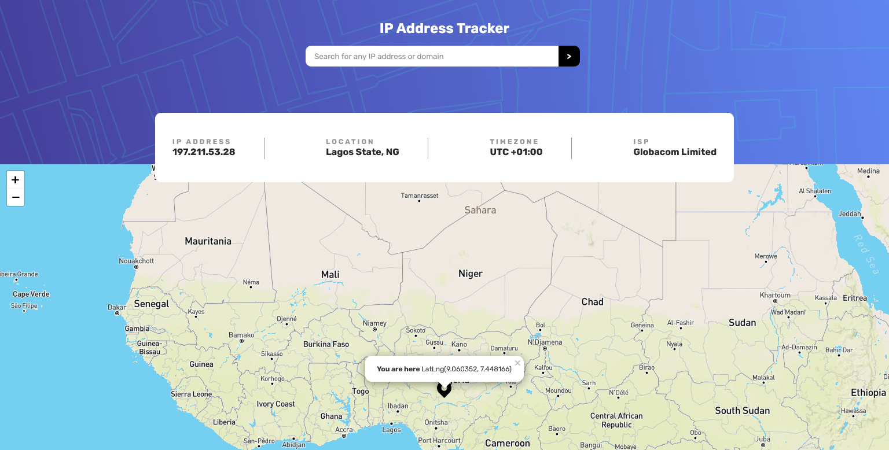

# Frontend Mentor - IP address tracker solution

This is a solution to the [IP address tracker challenge on Frontend Mentor](https://www.frontendmentor.io/challenges/ip-address-tracker-I8-0yYAH0). Frontend Mentor challenges help you improve your coding skills by building realistic projects. 

## Table of contents

- [Overview](#overview)
  - [The challenge](#the-challenge)
  - [Screenshot](#screenshot)
  - [Links](#links)
- [My process](#my-process)
  - [Built with](#built-with)
  - [What I learned](#what-i-learned)
  - [Continued development](#continued-development)
  - [Useful resources](#useful-resources)
- [Author](#author)
- [Acknowledgments](#acknowledgments)

**Note: Delete this note and update the table of contents based on what sections you keep.**

## Overview

### The challenge

Users should be able to:

- View the optimal layout for each page depending on their device's screen size
- See hover states for all interactive elements on the page
- See their own IP address on the map on the initial page load
- Search for any IP addresses or domains and see the key information and location

### Screenshot

### Links

- Solution URL: [https://github.com/Haybuka/iP-Address-Tracker]
- Live Site URL: [https://iptracke.netlify.app/]

## My process

### Built with

- Semantic HTML5 markup
- CSS custom properties
- Flexbox
- Desktop-first workflow
- leafletJs
- geoIpify

### What I learned

so while working on the project,i learnt how to use the leafletJs Map library, and also the Ip api.
I do intend to make a different clone of this site but using react js as that is my current focus.

I do wish to further my strangth in api usage and DOM rendering and also reading of documentation.

## Author

- Website - [Ndulue Paschal](https://www.your-site.com)
- Frontend Mentor - [@Haybuka](https://www.frontendmentor.io/profile/yourusername)
- Twitter - [@haybukarh](https://www.twitter.com/yourusername)

## Acknowledgments

First of all, i want to thank me.. Thank myself for not giving up, and also the frontendMentor team for putting this together
